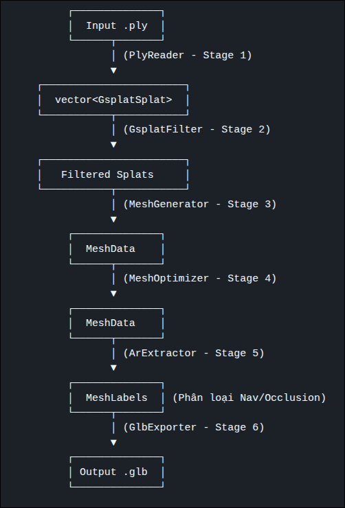
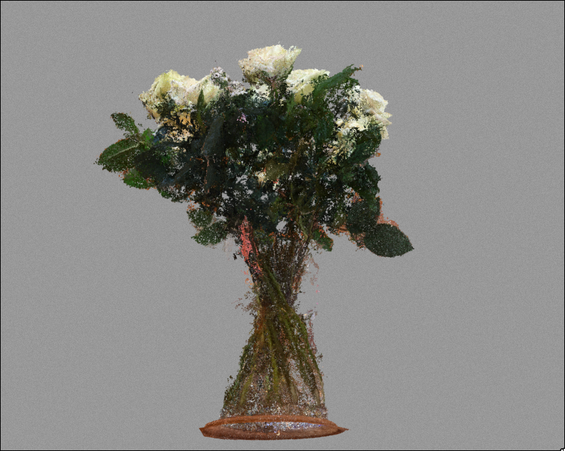
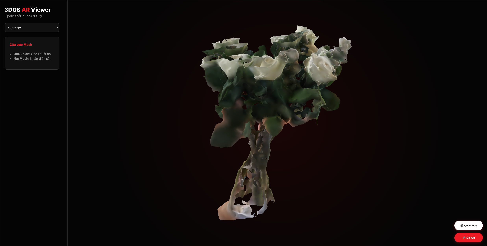
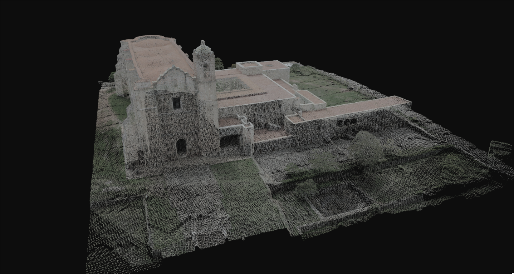
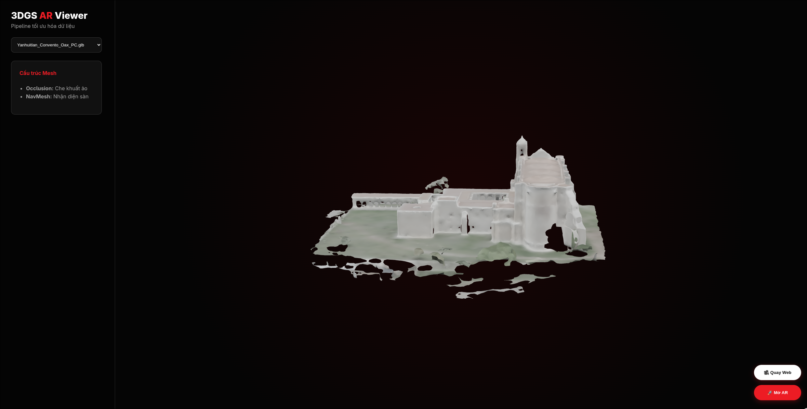
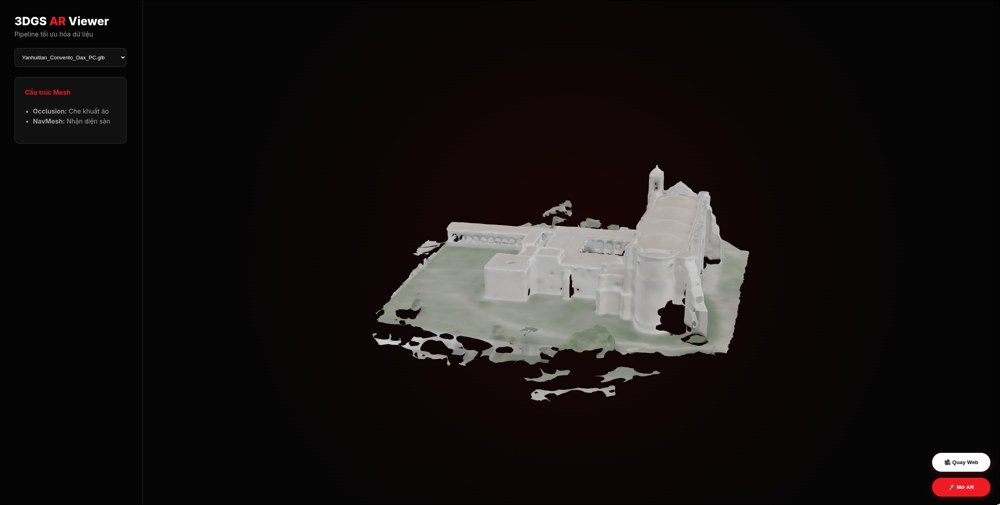
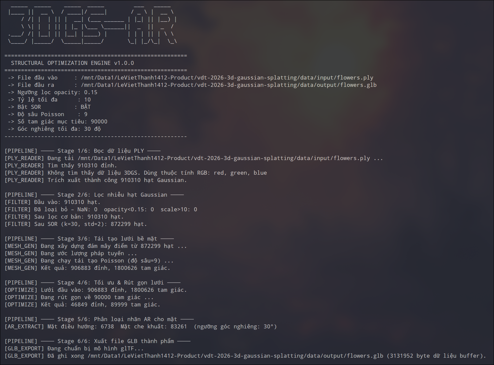

# 3DGS AR Pipeline

> Công cụ CLI viết bằng C++ để xử lý dữ liệu 3D Gaussian Splatting, dựng mesh, tối ưu hóa và xuất `.glb` cho Web/AR.

## Mục tiêu

Dự án này nhận dữ liệu đầu vào từ `.ply` hoặc `.splat`, lọc nhiễu, tái tạo bề mặt mesh, giảm số tam giác, tách phần dùng cho AR, rồi xuất ra file `.glb` để mở trên web hoặc điện thoại.

Luồng xử lý chính:

```text
Input (.ply/.splat)
  -> Read splats into vector<GaussianSplat>
  -> Filter opacity/outliers
  -> Mesh generation
  -> Mesh decimation
  -> AR extraction (navmesh + occlusion)
  -> Export .glb
```

## Tính năng

- Đọc dữ liệu 3DGS hoặc point cloud từ file `.ply` / `.splat`
- Lọc splats theo opacity, scale và outlier
- Dựng mesh từ point cloud bằng Poisson hoặc thuật toán tương đương
- Giảm poly bằng quadric decimation
- Tách occlusion mesh và navigation mesh
- Xuất `.glb` cho WebXR / model-viewer / demo trên điện thoại
- Có sẵn một web demo nhẹ bằng `model-viewer`
## Minh họa kết quả (Demo)

### 1. Sơ đồ xử lý (Pipeline Architecture)


### 2. So sánh trước và sau khi tối ưu hóa
Dưới đây là so sánh trực quan giữa đám mây điểm Gaussian thô (đầu vào `.ply`) và mô hình lưới tam giác tối ưu (đầu ra `.glb`):

| Đám mây điểm thô đầu vào (PLY) | Lưới tam giác tối ưu đầu ra (GLB) |
| :---: | :---: |
| **Flowers (Đầu vào: 25 MB)** <br>  | **Flowers (Đầu ra: 2.0 MB)** <br>  |
| **Yanhuitlan (Đầu vào: 20 MB)** <br>  | **Yanhuitlan (Đầu ra: 2.0 MB)** <br>  |

### 3. Giao diện Web Demo tích hợp AR
Trang Web Demo cho phép tải động tệp tin `.glb`, xoay/phóng to thu nhỏ mô hình và hỗ trợ tính năng AR trực quan trên điện thoại:


### 4. Vận hành qua dòng lệnh (CLI)
Luồng xử lý thời gian thực của công cụ `gsplat_ar` in chi tiết thông tin các stage qua terminal:


## Cấu trúc thư mục

```text
3dgs-ar-pipeline/
├── .gitignore                  # Bỏ qua các file rác, build/, vcpkg_installed/
├── CMakeLists.txt              # File cấu hình build CMake tổng
├── docker-compose.yml          # Cấu hình dịch vụ Docker
├── Dockerfile                  # Cấu hình container build dự án
├── LICENSE                     # Giấy phép dự án
├── README.md                   # Tài liệu hướng dẫn sử dụng
├── vcpkg.json                  # Manifest quản lý dependency (CLI11,...)
├── build/                      # [Ignore] Chứa file build trung gian
├── data/                       # Dữ liệu vào/ra
│   ├── input/                  # Chứa file .ply, .splat đầu vào
│   └── output/                 # Chứa file .glb đầu ra
├── include/                    # HEADER FILES (Interfaces)
│   ├── core/
│   │   ├── constants.hpp       # Hằng số cấu hình pipeline
│   │   ├── mesh_converter.hpp  # Chuyển đổi dữ liệu mesh
│   │   ├── stats_printer.hpp   # In log, thống kê runtime
│   │   └── types.hpp           # Struct dữ liệu chính (Splat, Mesh)
│   ├── io/
│   │   ├── glb_exporter.hpp    # Interface xuất .glb
│   │   └── ply_reader.hpp      # Interface đọc .ply
│   ├── pipeline/
│   │   └── optimization_pipeline.hpp # Interface điều phối workflow
│   └── processor/
│       ├── ar_extractor.hpp    # Phân loại Nav/Occlusion mesh
│       ├── gsplat_filter.hpp   # Lọc nhiễu, opacity
│       ├── mesh_generator.hpp  # Sinh mesh từ point cloud
│       └── mesh_optimizer.hpp  # Rút gọn lưới (decimation)
├── src/                        # SOURCE FILES (Implementation)
│   ├── main.cpp                # CLI entry point
│   ├── core/
│   │   ├── mesh_converter.cpp  # Hiện thực hàm chuyển đổi
│   │   └── stats_printer.cpp   # Hiện thực hàm in log
│   ├── io/
│   │   ├── glb_exporter.cpp    # Hiện thực xuất .glb
│   │   └── ply_reader.cpp      # Hiện thực đọc .ply
│   ├── pipeline/
│   │   └── optimization_pipeline.cpp # Logic chạy pipeline
│   └── processor/
│       ├── ar_extractor.cpp    # Hiện thực phân loại AR
│       ├── gsplat_filter.cpp   # Hiện thực bộ lọc
│       ├── mesh_generator.cpp  # Hiện thực dựng mesh
│       └── mesh_optimizer.cpp  # Hiện thực tối ưu mesh
├── tests/                      # UNIT TESTS
│   ├── test_filter.cpp         # Test logic lọc splat
│   └── test_io.cpp             # Test đọc ghi file
├── third_party/                # LIBRARIES
│   ├── happly/                 # Happly header-only
│   ├── tinygltf/               # TinyGLTF (header + json)
│   └── open3d/                 # Thư viện Open3D SDK
├── reports/                    # BÁO CÁO KỸ THUẬT
│   ├── images/                 # Ảnh minh họa báo cáo
│   ├── report.pdf              # File báo cáo PDF
│   └── report.tex              # Source file LaTeX
├── scripts/                    # BỘ CÔNG CỤ TỰ ĐỘNG
│   ├── bootstrap_vcpkg.sh      # Cài đặt vcpkg
│   ├── build.sh                # Script build nhanh
│   └── run.sh                  # Script chạy nhanh
└── web_demo/                   # DỰ ÁN DEMO WEB
    ├── ChristmasTree.glb       # Model mẫu
    ├── index.html              # Trang web viewer
    ├── README.md               # Hướng dẫn chạy web demo
    └── serve.py                # Server chạy demo cục bộ
```

### Ý nghĩa từng folder và file

#### Các file ở root
- `CMakeLists.txt`: file cấu hình build CMake, khai báo target, include path và thư viện liên kết.
- `vcpkg.json`: manifest của vcpkg, dùng để khai báo dependency như `CLI11`.
- `README.md`: tài liệu hướng dẫn chính của dự án.
- `Dockerfile`: cấu hình môi trường build/chạy bằng Docker.
- `docker-compose.yml`: file ghép các dịch vụ Docker để build hoặc demo nhanh.
- `LICENSE`: giấy phép sử dụng mã nguồn.

#### `data/`
- `data/input/`: nơi chứa file đầu vào như `.ply` hoặc `.splat`.
- `data/input/ChristmasTree.ply`: file mẫu để test pipeline.
- `data/input/flowers.ply`: file mẫu khác để test.
- `data/output/`: nơi chứa file kết quả sau khi chạy xong pipeline.
- `data/output/ChristmasTree.glb`: output mẫu tương ứng với `ChristmasTree.ply`.
- `data/output/flowers.glb`: output mẫu tương ứng với `flowers.ply`.

#### `include/`
Đây là thư mục khai báo header, tức là nơi định nghĩa interface, struct, class và hàm để các file `.cpp` dùng chung.

- `include/core/`: các kiểu dữ liệu lõi và công cụ dùng chung.
  - `constants.hpp`: hằng số mặc định của pipeline, ví dụ ngưỡng opacity, số tam giác mục tiêu, góc navmesh.
  - `types.hpp`: định nghĩa `GaussianSplat`, `MeshData`, `MeshLabels`, `PipelineOptions`.
  - `mesh_converter.hpp`: helper chuyển đổi giữa `MeshData` và kiểu mesh của thư viện ngoài như Open3D/tinygltf.
  - `stats_printer.hpp`: helper in thống kê, thời gian xử lý, số lượng splat/triangle.
- `include/io/`: các interface liên quan nhập/xuất dữ liệu.
  - `ply_reader.hpp`: khai báo bộ đọc `.ply` / `.splat`.
  - `glb_exporter.hpp`: khai báo bộ xuất `.glb`.
- `include/processor/`: các bước xử lý chính của pipeline.
  - `gsplat_filter.hpp`: khai báo bước lọc opacity và outlier.
  - `mesh_generator.hpp`: khai báo bước dựng mesh từ splat/point cloud.
  - `mesh_optimizer.hpp`: khai báo bước giảm poly và dọn mesh.
  - `ar_extractor.hpp`: khai báo bước tách navmesh và occlusion mesh.
- `include/pipeline/`: lớp điều phối toàn bộ luồng xử lý.
  - `optimization_pipeline.hpp`: khai báo pipeline tổng, nối đọc -> lọc -> mesh -> tối ưu -> xuất.

#### `src/`
Đây là nơi hiện thực logic thật của chương trình.

- `src/main.cpp`: điểm vào của ứng dụng, parse tham số CLI rồi gọi pipeline.
- `src/core/`: code hiện thực các helper dùng chung.
  - `mesh_converter.cpp`: hiện thực các hàm chuyển đổi mesh.
  - `stats_printer.cpp`: hiện thực các hàm in thống kê.
- `src/io/`: code xử lý nhập/xuất dữ liệu.
  - `ply_reader.cpp`: hiện thực đọc file `.ply` / `.splat`.
  - `glb_exporter.cpp`: hiện thực ghi kết quả ra `.glb`.
- `src/processor/`: code của các thuật toán xử lý.
  - `gsplat_filter.cpp`: hiện thực lọc splat.
  - `mesh_generator.cpp`: hiện thực dựng mesh.
  - `mesh_optimizer.cpp`: hiện thực decimation / simplify mesh.
  - `ar_extractor.cpp`: hiện thực phân loại mặt cho AR.
- `src/pipeline/`:
  - `optimization_pipeline.cpp`: ghép tất cả bước xử lý thành một workflow chạy tự động.

#### `tests/`
- `test_io.cpp`: test phần đọc file đầu vào và xuất dữ liệu.
- `test_filter.cpp`: test phần lọc opacity/outlier.

#### `third_party/`
- `third_party/happly/`: chứa thư viện header-only `happly` để đọc PLY.
  - `happly.h`: file header chính.
- `third_party/tinygltf/`: chứa `tinygltf` và các file phụ trợ để xuất glTF/GLB.
  - `tiny_gltf.h`: file header chính.
  - `json.hpp`: dependency JSON cho tinygltf.
  - `stb_image.h`: thư viện hỗ trợ đọc ảnh nếu cần texture.
  - `stb_image_write.h`: thư viện hỗ trợ ghi ảnh nếu cần texture.

#### `scripts/`
- `bootstrap_vcpkg.sh`: script bootstrap vcpkg và cài dependency.
- `fetch_third_party.sh`: script tải header-only libs về `third_party/`.
- `build.sh`: script cấu hình và build project.
- `run.sh`: script chạy pipeline nhanh hoặc interactive.

#### `web_demo/`
- `index.html`: trang web demo dùng `model-viewer` để xem và AR.
- `serve.py`: server Python nhỏ để chạy local web demo.
- `README.md`: hướng dẫn riêng cho web demo.
- `ChristmasTree.glb`: file demo mẫu để test nhanh.

#### `plans/`
- `01_dependencies.md`: kế hoạch cài môi trường và dependency.
- `02_structure.md`: mô tả cấu trúc thư mục mục tiêu.
- `03_core_headers.md`: thiết kế các header lõi.
- `04_src_impl.md`: kế hoạch hiện thực các file `.cpp`.
- `05_web_demo.md`: kế hoạch demo web.
- `06_scripts.md`: kế hoạch các script hỗ trợ.
- `07_algorithm_details.md`: ghi chú chi tiết thuật toán.
- `image_n.md`: ghi chú hoặc nội dung liên quan ảnh minh họa.
- `technology_used.md`: danh sách công nghệ sử dụng.

#### `reports/`
- `reports/report.tex`: file LaTeX cho báo cáo học thuật.
- `reports/images/`: ảnh minh họa dùng trong báo cáo.
- `reports/out/`: output sau khi build báo cáo, ví dụ PDF.

#### `build/`, `vcpkg/`, `vcpkg_installed/`
- `build/`: thư mục build do CMake sinh ra, chứa file tạm, object file, cache, executable.
- `vcpkg/`: source code của vcpkg nếu clone local trong repo.
- `vcpkg_installed/`: nơi lưu package đã cài hoặc artifact liên quan của vcpkg.

## Thư viện và công nghệ

- C++17
- CMake
- vcpkg
- Open3D
- CLI11
- happly
- tinygltf
- nlohmann/json

## Môi trường cần có

- Linux, khuyến nghị Arch Linux
- GCC hoặc Clang hỗ trợ C++17
- CMake 3.15+
- Git, curl

## Cài đặt nhanh trên Arch Linux

```bash
sudo pacman -S base-devel cmake git curl zip unzip tar pkgconf python
```

## vcpkg là gì

`vcpkg` là công cụ quản lý thư viện C/C++. Trong project này nó dùng để cài các dependency lớn như `CLI11`.

- `vcpkg.json`: khai báo dependency của project
- `vcpkg/`: source code của tool vcpkg
- `vcpkg_installed/`: thư mục chứa các package đã được cài cho project

Nếu đã clone sẵn `vcpkg/` trong repo, chỉ cần trỏ biến môi trường:

```bash
export VCPKG_ROOT=/mnt/Data1/LeVietThanh1412-Product/vdt-2026-3d-gaussian-splatting/vcpkg
export PATH=$VCPKG_ROOT:$PATH
```

## Tải thư viện header-only

Chạy script để tải `happly` và `tinygltf`:

```bash
./scripts/fetch_third_party.sh
```

## Build project

### Cách build chuẩn bằng CMake + vcpkg

```bash
cd /mnt/Data1/LeVietThanh1412-Product/vdt-2026-3d-gaussian-splatting
$VCPKG_ROOT/vcpkg install
cmake -S . -B build -DCMAKE_TOOLCHAIN_FILE=$VCPKG_ROOT/scripts/buildsystems/vcpkg.cmake -DCMAKE_BUILD_TYPE=Release
cmake --build build --config Release -j$(nproc)
```

### Nếu Open3D không có sẵn trong vcpkg local

Một số môi trường local có thể không có port `open3d`. Khi đó có 2 hướng:

1. Cài Open3D từ hệ thống và cho CMake biết đường dẫn `Open3D_DIR`
2. Tạm dùng mesh stub trước, sau đó thay bằng Open3D khi dependency sẵn sàng

Ví dụ:

```bash
cmake -S . -B build -DOpen3D_DIR=/path/to/Open3D/share/Open3D
cmake --build build -j$(nproc)
```

## Chạy chương trình

Chạy bằng script:

```bash
./scripts/run.sh
```

Hoặc chạy tay:

```bash
./build/gsplat_ar \
  --input data/input/flowers.ply \
  --output data/output/flowers.glb \
  --prune-opacity 0.15 \
  --target-triangles 60000 \
  --nav-slope 30.0
```

## Ý nghĩa các bước xử lý

### 1. Đầu vào
Đọc file `.ply` / `.splat` và lưu vào `vector<Splat>`.
Có thể tải dữ liệu từ [sketchfab.com](https://sketchfab.com/search?features=downloadable&q=tag%3Aply&type=models)

### 2. Tiền xử lý
Lọc theo opacity, scale, NaN và outlier để giữ lại các splats sạch.

### 3. Mesh generation
Chuyển splats thành point cloud, sau đó dựng mesh bằng Poisson hoặc Marching Cubes.

### 4. Optimization
Giảm số tam giác bằng quadric decimation để file nhẹ hơn và chạy nhanh hơn trên AR.

### 5. AR extraction
Tính normal của từng mặt để tách:
- `navmesh`: mặt đi được / mặt phẳng
- `occlusion`: mặt che khuất vật thể ảo

### 6. Output
Xuất mesh cuối cùng ra `.glb`.

## Web demo

Thư mục `web_demo/` chứa trang web demo dùng `model-viewer`.

```bash
python3 web_demo/serve.py
```

Sau đó mở:

```text
http://localhost:8000
```

Nếu muốn test trên điện thoại, dùng cùng mạng LAN và mở bằng IP máy chạy server.

## Thư mục `build/` là gì

`build/` là thư mục CMake sinh ra khi build ngoài source tree.

- chứa file tạm, file object, cache CMake, executable build ra
- không nên commit lên git
- có thể xóa an toàn nếu muốn build lại từ đầu

## Thư mục `vcpkg_installed/` là gì

Đây là nơi vcpkg lưu package đã cài cho project hoặc file cài đặt liên quan.

- không cần chỉnh tay nếu không biết rõ
- nếu muốn cài lại dependency thì có thể xóa rồi chạy `vcpkg install` lại

## Thứ tự code khuyến nghị nếu làm lại từ đầu

1. `include/core/types.hpp`
2. `include/io/ply_reader.hpp` và `src/io/ply_reader.cpp`
3. `include/processor/gsplat_filter.hpp` và `src/processor/gsplat_filter.cpp`
4. `include/io/glb_exporter.hpp` và `src/io/glb_exporter.cpp`
5. `include/pipeline/optimization_pipeline.hpp` và `src/pipeline/optimization_pipeline.cpp`
6. `src/main.cpp`
7. `mesh_generator`, `mesh_optimizer`, `ar_extractor`
8. `tests/`
9. `web_demo/`

## Ghi chú

- Nếu muốn hiểu dự án nhanh, đọc theo thứ tự: `README.md` -> `include/core/types.hpp` -> `src/main.cpp` -> `src/pipeline/optimization_pipeline.cpp`.
- Nếu build lỗi dependency, kiểm tra lại `VCPKG_ROOT`, `Open3D_DIR` và nội dung `vcpkg.json`.